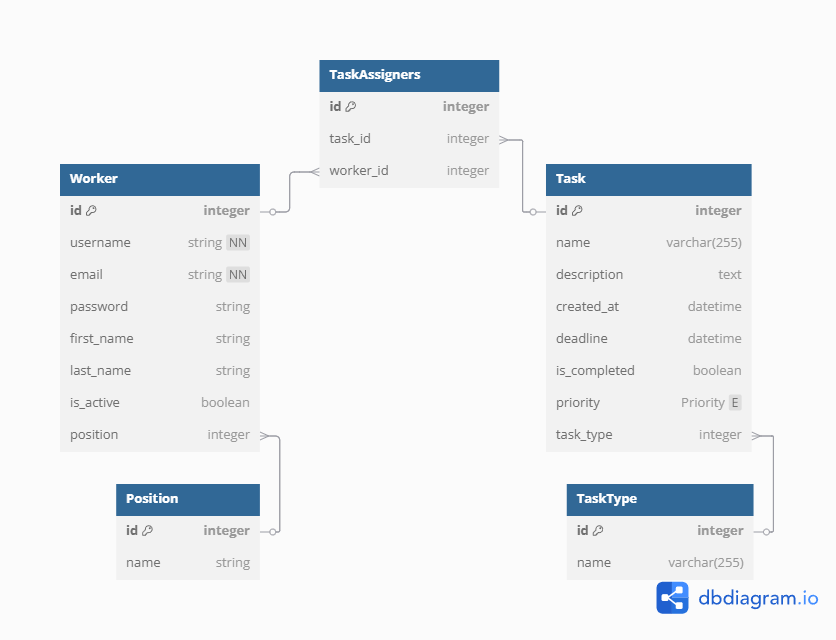

# Task Manager

Task Manager is a Django-based project designed to help users manage their tasks efficiently. It provides a simple and intuitive interface for creating, updating, and tracking tasks.

## Getting Started

To get started with Task Manager, clone the repository and set up the project locally.

### Prerequisites

- Python 3.x
- Django
- pip (Python package manager)

### Installation

1. Clone the repository:
  ```shell
  git clone https://github.com/yarzhuravlov/task-manager-mate.git
  cd task-manager-mate
  ```

2. Create and activate a virtual environment:
  ```shell
  python -m venv venv
  source venv/bin/activate  # On Windows: venv\Scripts\activate
  ```

3. Install the required dependencies:
  ```shell
  pip install -r requirements.txt
  ```

4. Apply migrations:
  ```shell
  python manage.py migrate
  ```

5. Run the development server:
  ```shell
  python manage.py runserver
  ```

6. Open your browser and navigate to `http://127.0.0.1:8000/`.

## Features

- Create, update, and delete tasks.
- Mark tasks as completed.
- Organize tasks by priorities.
- Search functionality to find tasks by name, description, and assignees, with the ability to select specific fields to apply the search criteria.
- User authentication and authorization.

### User Registration with Email Confirmation

Task Manager includes a user registration feature with email confirmation to ensure secure account creation. The process involves the following steps:

1. **User Registration**: Users can sign up by providing their email address, username and password.
2. **Email Confirmation**: After registration, an email with a confirmation link is sent to the user's email address.
3. **Account Activation**: Users must click the confirmation link to activate their account before they can log in.

This feature enhances security and ensures that only valid email addresses are used for account creation.

## Database Diagram

Below is the database diagram for the Task Manager project, which outlines the relationships between the models used in the application:



## Planned Features

- Availability to reset filters.
- Sorting tasks by type.
- Authentication using Google.
- Displaying completed and pending tasks for each worker.
- Adding tags to tasks with many-to-many relationships.
- Support for Projects and Teams to enhance collaboration.

## Acknowledgments

- Inspired by [Django documentation](https://docs.djangoproject.com/).
- Thanks to the open-source community for their contributions.
